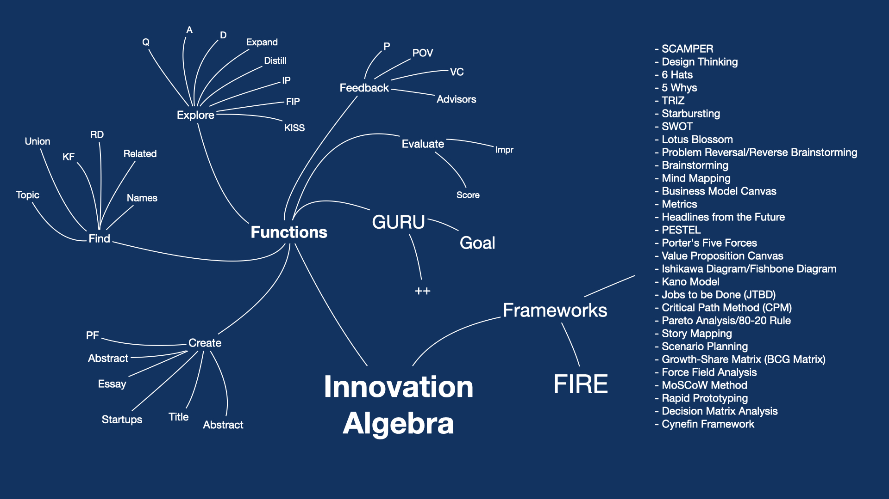

Watch the IA video. [Slides.PDF](IA-slides-june-2023.pdf)

### EXTENDED MEETUP: Friday, July 7

- **Tailgating** with general chit-chat starts 15 minutes before the offical start.
- How to use **creativity frameworks** like SCAMPER, TRIZ etc.like a pro using IA.
- Interview with **Wei 'Larry' Liu** on **advanced persona prompt engineering**.
- Note: Many people stay after the offical meetup to talk about AI. Budget time appropriately.
- [Sign up](https://lu.ma/ncjjujgn)

  
# Innovation Algebra for ChatGPT

**"Innovation Algebra (IA) is like a Swiss Army knife for knowledge processing and innovation; it's a versatile tool that brings structure and clarity to the complex world of ideas, helping innovators and thinkers to systematically navigate and cultivate the landscape of possibilities."**

Innovation Algebra (IA) is an experimental GPT framework designed for systematic generation, processing and evaluation of ideas. What sets IA apart is its integration within ChatGPT, allowing users to leverage the natural language processing capabilities of ChatGPT in combination with the structured functions of IA.

With a defined set of functions and thinking and analysis frameworks, IA facilitates the retrieval, analysis, and synthesis of knowledge across various domains. Function pipelining, a key feature of IA, allows for the sequential chaining of functions, streamlining complex multi-step tasks such as combining knowledge from different fields, identifying the forefront of research, and generating profound insights.

Innovation Algebra operating within ChatGPT offers a blend of structure and flexibility, making it an invaluable asset for entepreneurs, researchers, academics, and professionals seeking to navigate and harness the depth and breadth of knowledge. It is a great model to re-structure your thinking.

IA is a 'base' for innovation in multiple domains, leading to new GPT super-prompts in areas such as education and psychoanalysis.

## Get Started Now

- [>>> Start chatting IA 3.0 (Under development) <<<](https://chat.openai.com/share/2b4b436a-b418-4474-8aad-ef2ab271655c)
- [>>> Start chatting IA 2.7 <<<](https://chat.openai.com/share/c7fb98e7-2334-4008-8714-a6a2191052cb)
- [>>> Start chatting IA 2.6 <<<](https://chat.openai.com/share/8d15d103-52fe-468c-bde9-e35d4256d519)
- [>>> Start chatting IA 2.5 <<<](https://chat.openai.com/share/655ced1d-63d9-4ef8-93e1-a93074b655e7)
- [>>> Start chatting IA 2.2 <<<](https://chat.openai.com/share/977119a8-60ef-49d4-8a0f-4e0ae6ce9ff1)
- [>>> Start chatting IA 2.1 <<<](https://chat.openai.com/share/139f640b-b979-4c21-8c0e-e780bf84a4f1)

Instructions:

* Ensure you have a **ChatGPT Pro** subscription. **GPT 4** capabilities are required.
* Click the above link to open a saved ChatGPT session with the IA prompt loaded.
* Click **'Continue the conversation'**.
* Start using IA by stating your goals. You can keep it high-level as IA will drill down into topics all by itself.
* **Tip**: If you are stuck, simply type `++` to consult the Guru (IA 2.5+).  IA 3.0 will accept `go` and `++`.

## Case Studies

How do you innovate in the knowledge frontier? Become a better innovator? Solve hard problems?

:star: Start by simply reading the [IA case studies](/casestudies) on topics such as creativity, engineering, city planning, business & startups, science, the environment and more. It is a crash course on how to think critically. Then apply what you learned right away using IA.

* [IA for Entrepreneurs](swiss-army-knife-for-entreprenuers.md)
* [IA for City Planners](city-planning.md)
* [Hallucination in the Knowledge Frontier](kf-hallucinator.md)

> ​The expanding knowledge frontier presents both challenges and opportunities, and effective navigation likely requires a combination of AI's computational power and the intuitive understanding of human experts. Although the dynamic between AI and the knowledge frontier's expansion may accelerate, it also opens unprecedented opportunities for discovery and innovation. As we navigate this new frontier, it's crucial to ensure a balanced approach, leveraging AI's capabilities while acknowledging the irreplaceable value of human expertise. The future lies not in competing with AI, but in collaboratively navigating the expanding knowledge frontier, ushering in an era of remarkable discovery and innovation.

## Are you an IA power-user?

* :fire: Join the [Innovation Algebra Users Group](https://lu.ma/innovationalgebra). We have events to teach you how to innovate, create, and research.
* Join the [GPT Framework Community](https://twitter.com/i/communities/1669253796118278144) to solve specialized problems.
* Are you spending a lot of time using IA (multiple hours)? Running into ChatGPT limits? Contact me for big research projects, speedups and work arounds.
* Contact Hannes [@HiDeeeps](https://twitter.com/HiDeeeps).

## Guru Mode for Guided Innovation (IA 2.5+)

* Since innovation frameworks are complex, IA 2.5 introduced "Guru mode" to guide your exploration. Simply set your Goal() and invoke Guru mode via ++. Guru will pick IA functions and frameworks to guide you to your goal. 

* IA 2.7 introduced the Mentor, which observes the IA sessions. You can ask it for feedback, but in general it just observes and sometimes speaks. 

> Some argue that while AI can manage large volumes of information and automate decision-making, its effectiveness in more nuanced, context-dependent, and creative problem-solving tasks remains questionable. Human intuition, emotion, and creativity can play a significant role in these areas, challenging the idea that AI can completely navigate the knowledge frontier on its own.

## Tips

* Needless to say, you need to have a basic knowledge of [ChatGPT](https://chat.openai.com/) and what a prompt is.
* Read a few case studies, even if the topic does not interest you.
* Beginners can safely ignore Innovation Algebra output that looks like scary code.
* You don't need to use the IA functions exactly as defined. You can also just type your request. 
* You can do a lot by setting a goal, and invoking the Guru to guide you.
* If you don't know what to do next, type `++` to invoke the Guru. It will guide you.
* You can do a lot with the core functions KF, RD, Q, and Essay. Learn them.
* My suggestion is to keep a list of the frameworks handy (see below). Try the frameworks and see what they do. You don't need to be an expert to use them.
* IA conversations can get very long, very quickly. At some point, ChatGPT runs out of 'memory', and its IQ drops like 50 points. 
* I highly recommend ChatGPT Plus (paid) using GPT 4. As of 6/14/2023, Chat GPT 3.5 (turbo) has problems following IA's complicated logic.

  
## Supported Innovation Frameworks (IA 2.2+)

Thinking frameworks such as brainstorming, SCAMPER, SWOT, TRIZ or PESTEL analysis play pivotal roles in problem-solving across numerous fields. While humans are limited by their cognitive capacities in applying these frameworks, AI can utilize hundreds, continually refining its approach based on new data and outcomes. This ability has shown remarkable promise in fields ranging from medical diagnostics to financial forecasting to chip design.

My favorites for idea generation are starred. These are the secret weapons of the innovators.

1. :star: **SCAMPER** - It stands for Substitute, Combine, Adapt, Modify, Put to another use, Eliminate, and Reverse. It's a brainstorming tool used to improve products or services. For example, you can substitute a component of a product with something else, combine it with another product, or adapt it for a different use.

2. :star: **Design Thinking** - A methodology for solving complex problems. It involves understanding the human needs involved, re-framing the problem, creating many ideas in brainstorming sessions, and adopting a hands-on approach in prototyping and testing.

3. :star: **6 Hats** - Edward de Bono's Six Thinking Hats is a tool for group discussion and individual thinking involving six colored hats. Each color represents a different perspective. It's used to look at decisions from multiple viewpoints.

4. **5 Whys** - A problem-solving technique that involves asking "why" five times to get to the root cause of a problem.

5. :star: **TRIZ** - A Russian acronym for "Theory of Inventive Problem Solving". It's a methodology for systematic problem solving. It's based on logic, data, and research, not intuition.

6. **Starbursting** - A brainstorming technique focusing on generating questions. It helps in exploring new avenues and challenges by questioning every aspect of the project.

7.:star:  **SWOT** - Stands for Strengths, Weaknesses, Opportunities, and Threats. It's a strategic planning tool for identifying and analyzing these four elements of a project or business venture.

8. **Lotus Blossom** - A diagram used for exploring all the elements of a problem. It encourages you to elaborate on the problem by looking at it from multiple angles.

9. **Problem Reversal/Reverse Brainstorming** - It involves reversing the problem's direction. Instead of asking how to solve it, you ask how you could cause it. It often leads to unique solutions.

10. **Brainstorming** - A group creativity technique used to find a solution for a specific problem by gathering a list of ideas contributed by participants.

11. **Mind mapping** - A graphical way to represent ideas and concepts. It's visual thinking tool that helps structuring information, helping you to analyze, comprehend, synthesize, recall and generate new ideas.

12. **Business Model Canvas** - A strategic management tool that provides a visual framework for developing, describing, and analyzing a business model.

13. **Metrics** - Measurement tools that quantify information. In business, metrics are used to track the effectiveness of processes over time.

14. :star: **Headlines from the future** - A creativity tool in which you imagine what headlines in the future might say about your product or organization, helping you define what success looks like and what you need to do to achieve it.

15. **PESTEL** - Stands for Political, Economic, Social, Technological, Environmental, and Legal. It's a framework used for scanning an organization’s external macro environment.

16. **Porter's Five Forces** - Analyzes an industry's competitiveness and attractiveness. The forces are the threat of new entrants, threat of substitutes, bargaining power of buyers, bargaining power of suppliers, and industry rivalry.

17. **Value Proposition Canvas** - A tool used to understand the fit between product features and customer requirements, ensuring that there’s a match between the value created and the customer’s needs.

18. **Ishikawa Diagram/Fishbone Diagram** - A cause-and-effect diagram that helps teams identify, explore, and display the possible causes of a specific issue or problem.

19. **Kano Model** - A theory for product development and customer satisfaction. It classifies customer preferences into categories (basic, performance, excitement)

... and several more.

These frameworks can be used individually or in combination depending on the context and the nature of the problem you are trying to solve. The key is to encourage diverse thinking and to approach problems from different angles.

## FIRE meta-framework (IA 2.2+)

IA also employs a new meta-framework called [FIRE](FIRE.md), which creates a way to evaluate ideas using all the frameworks. So if you do not know how to proceed with evaluation/improvement, type `FIRE`.

## Research

The principles behind IA can be applied to other problems/domains. Most interestingly, IA can be used to **enhance itself on-the-fly** by extending its own algebra of functions and frameworks. 

Most interestingly, these principles can be used to create new experts/personas very quickly. This is incredibly useful way to get the most out of GPT.

Related GPT Frameworks by [Wei 'Larry' Liu](https://twitter.com/w_liu_):

* [Larry's Github Repos](https://github.com/1arry1iu) - Many highly specialized prompts.
* [Universal Teacher (UT)](https://github.com/1arry1iu/universal-teacher) - An active learning framework. 
* [Universal PsychoAnalyst (UPA)](https://github.com/1arry1iu/universal-psychoanalyst) - Need help? 
* [Universal Story Teller (UST)](https://github.com/1arry1iu/universal-storyteller) - The most comprehensive story teller. 

Learn the process of developing a new GPT framework:

* [JesterBot / Joke Algebra](https://chat.openai.com/share/56aa5327-925a-4e50-806b-401f39df4261)
* [Algebra for Supply Chain + Sales](https://chat.openai.com/share/9346a157-2bd9-41b1-9a19-e62fbf479d5a)
* [Quickly generate an Expert Persona](https://github.com/1arry1iu/everything)
* [Create Fact Checker persona](https://chat.openai.com/share/a6660567-5d53-49bb-93a3-c30607eeeaf1)

People:

* Hannes Marais (IA) ([@HiDeeeps](https://twitter.com/HiDeeeps))
* Wei 'Larry' Liu (UT, UPA) ([@w_lui_](https://twitter.com/w_liu_))
  
## IA Low-level Examples

Experts can invoke low-level IA functions and frameworks direcly, but you need to know the **magic incantations** below. This way of talking to IA is rapidly being surpassed by Guru mode, which can do better and more creative planning than most humans.

**1. `Topic("quantum computing") | D | Names`**
   - **Explanation**: Retrieves knowledge about quantum computing, provides detailed information including algorithms and techniques related to quantum computing, and then lists top people, companies, and products that are related to quantum computing.

**2. `Topic("artificial intelligence") | KF | Q | A`**
   - **Explanation**: Retrieves knowledge on artificial intelligence, identifies the cutting-edge ideas in the domain, lists top research questions, and then answers each of them.

**3. `Essay("space exploration", tokens=500, profundity=8, emotionalImpact=7) | Title | Abstract`**
   - **Explanation**: Generates an essay on space exploration with approximately 500 tokens, with a high profundity level and emotional impact, then creates a title for the essay and generates an abstract that summarizes the content and insights.

**4. `Score(Essay("modern art", tokens=300, profundity=6, emotionalImpact=8), Categories=["Originality", "Emotional Impact"])`**
    - **Explanation**: Generates a short essay on modern art with profundity and emotional impact, and then evaluates and scores the essay according to originality and emotional impact categories.
    
[More Examples](examples.md)

## The ChatGPT Prompt

* Here is the current [ChatGPT prompt](/ia-gpt-4.md) (latest version 2.7).
* The complexity of IA now has out-grown GPT 3.5, and my work is now just focusing on GPT 4. I know it leaves a lot of folks behind, so help to make it work on GPT 3.5 is appreciated.
* You will likely run into usage limits of GPT-4 since IA tends to create long and interesting sessions. Currently there is no work-around for this.

## Getting Help

You might be overwhelmed with all the possibilities of Innovation Algebra. Or not sure where to start with your problem. Or maybe you are interested in how to introduce IA in your organization. Or you need IA tailored/extended for specific business use cases, for example {X} management, business process model improvements, specialized educational content, etc.  

If you need help, please reach out to Hannes Marais ([LinkedIn](https://www.linkedin.com/in/hannesmarais/)) for a 1-on-1 pair-innovation session. If I cannot help you, I can possibly refer you to someone else with appropriate expertise.

## Citing IA

Innovation Algebra, in the right hands, is an extremely powerful tool. It can explore & research so far and wide in a single session that it can make you look super-human to others. So I understand that there might be reluctance to mention the contribution of IA to your work, research, and/or creative content, so you may not want to cite IA. 

Welcome to the club of "secret cyborgs" :) It's OK.

If do you post about IA, please use [**#InnovationAlgebra**](https://twitter.com/search?q=%23InnovationAlgebra&src=typed_query) so we can find it!  And consider linking to this page; we will return the favor.

I appreciate feedback and success stories from the innovation trenches. Reach out via Twitter [@HiDeeeps](https://twitter.com/HiDeeeps) or [LinkedIn](https://www.linkedin.com/in/hannesmarais/).

## Thanks

We stand on the shoulders of so many others. The inventors, innovators, entrepreneurs, scientists and business people that teach us how to think, our eco-system of startups, incubators and most recently the AI Chatbots and APIs from OpenAI and others. 

Knowledge is power, and knowledge shared is power multiplied. Let's share!

Hannes MARAIS

